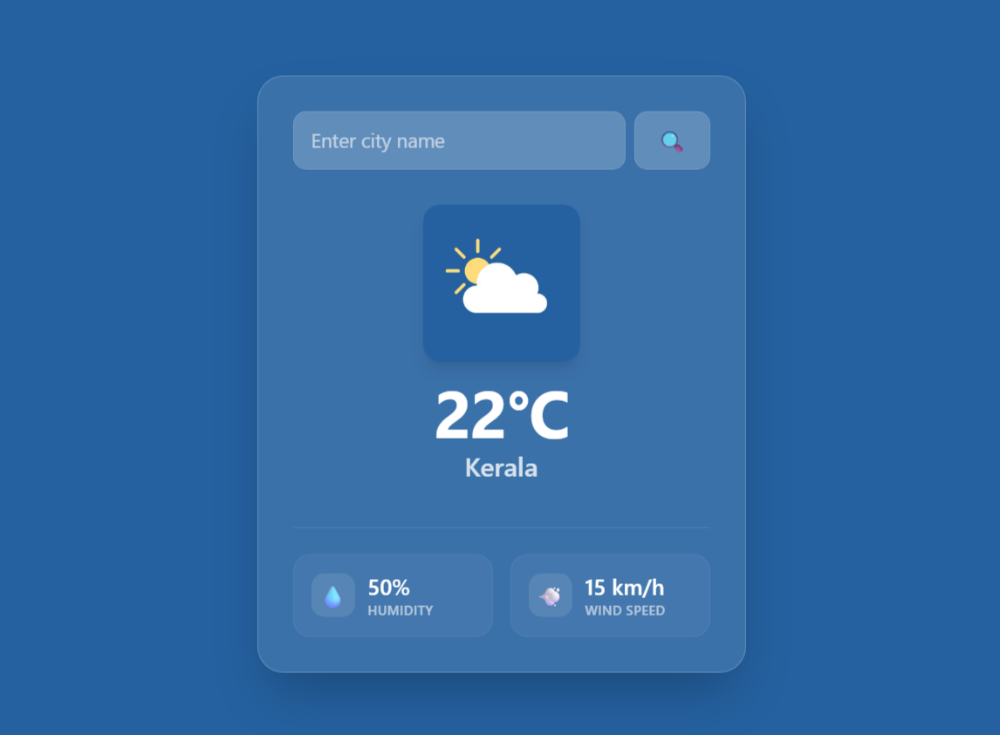

# 🌤️ Weather App

A sleek, responsive, and minimalist Weather Application built using vanilla JavaScript, HTML, and CSS. The app allows users to search for real-time weather information by city, displaying current temperatures, humidity levels, and wind speeds with a modern glassmorphism UI design. [Weather App Live](https://gopika-box.github.io/WeatherApp/)

## 🚀 Features

* **Real-time Weather Data:** Fetches live weather updates based on user queries.
* **Comprehensive Metrics:** Displays temperature (in °C), humidity percentage, and wind speed (in km/h).
* **Dynamic Visuals:** Custom weather status icons that shift depending on the current conditions.
* **Glassmorphic UI:** Features a beautifully styled glass-like translucent interface optimized for mobile and desktop viewports.
* **Instant Search:** Seamless search integration utilizing a quick-action search button.

---

## 🛠️ Tech Stack

* **Frontend:** HTML5, CSS3 (Modern Flexbox/Grid, Custom Properties)
* **Scripting:** Vanilla JavaScript (ES6+ Async/Await, DOM Manipulation)
* **API:** [OpenWeatherMap API](https://openweathermap.org/api)
